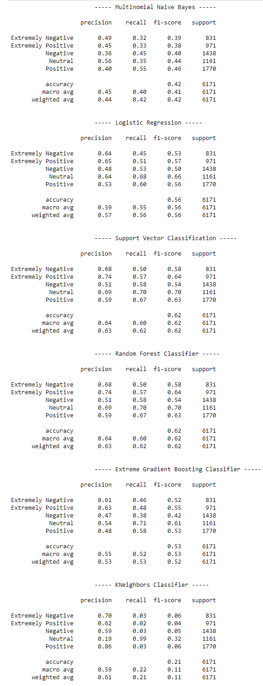
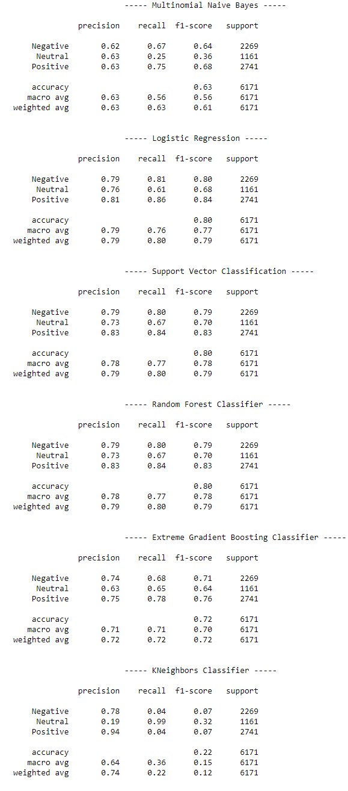

# Sentiment Analysis : Predicting sentiment of COVID-19 tweets

This is a end of Course Project to practice data cleaning with regex and apply machine learning classification algorithms to predict the sentiment of COVID-19 tweets. 

Summary of the results of the models that were tested.  First image depicting metrics over 5 Categories

Second image depicting metrics over 3 Categories

 

One minor change has been made to the usual list of "stopwords" provided by the nltk library -> Removal of "not" and words ending with "'t".

The <b>distribution of sentiments</b> in the dataset has been: 

In terms of preprocessing: The text has been deprived of tags(referencing other users), weblinks, digits and punctuations. As these do not contribute towards sentiment.  Followed by TF-IDF considering the vocabulary of the training set as a real world use case. Hence the results visible in the first two images are on the validation set to prevent any type of data leakage.